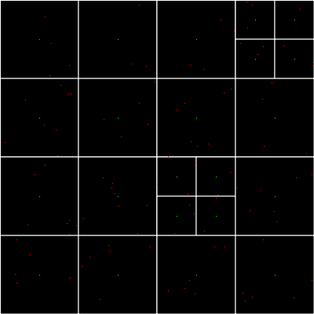

# Quadtree Implementation and Visualiser
This is an implementation of a Quadtree from the pseudocode on
this [wikipedia page](https://en.wikipedia.org/wiki/Quadtree#Pseudocode).

This project also features a drawing library that is used to generate a
png img of the quadtree which is useful for presentation purposes.

## How to Run
```sh
go run .
```

This will generate a random quadtree and generate an output
visualisation in output.png.


- Red dots are the points in the tree
- Green dots are the centres of each of the boxes.
